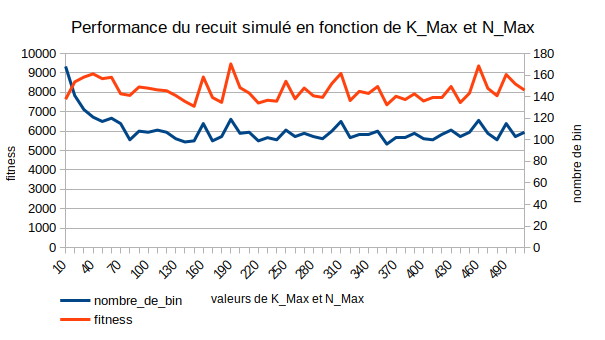

Thibaut Delplanque

# Rapport - projet Bin-Packing 1D

## Calcule de la borne inférieur

Pour le calcul de la borne inférieur de chaque jeu de données, nous réalisions le calcul suivant : $(somme\ des\ poids\ des\ items) /(taille\ maximum\ d'un\ bin)$ arrondis au supérieur. ce qui nous donne pour chaque jeu de données, les valeurs suivantes :

| nom du jeu de données | borne inférieur théorique |
| :-------------------- | :-----------------------: |
| binpack1d_00          |            13             |
| binpack1d_01          |            99             |
| binpack1d_02          |            198            |
| binpack1d_03          |            20             |
| binpack1d_04          |            40             |
| binpack1d_05          |            83             |
| binpack1d_06          |            167            |
| binpack1d_11          |            25             |
| binpack1d_12          |            26             |
| binpack1d_13          |            252            |
| binpack1d_14          |            215            |
| binpack1d_21          |            11             |
| binpack1d_31          |            61             |

Le calcule de la borne inférieure va nous permettre par la suite, de comparer les résultats obtenus pour les prochains algorithmes.

## First Fit Decreasing

L'algorithme du **first fit decreasing** consiste à trier la liste des items par ordre décroissant, et a essayer de ranger les items, soit dans un bin qui a encore de la place, soit dans un nouveau bin. 

Avec cet algorithme, nous obtenons les résultats suivants pour les différents jeux de données :

| nom du jeu de données | borne inférieur théorique | résultat avec le first fit decreasing |
| --------------------- | :-----------------------: | :-----------------------------------: |
| binpack1d_00          |            13             |                  13                   |
| binpack1d_01          |            99             |                  100                  |
| binpack1d_02          |            198            |                  201                  |
| binpack1d_03          |            20             |                  23                   |
| binpack1d_04          |            40             |                  45                   |
| binpack1d_05          |            83             |                  94                   |
| binpack1d_06          |            167            |                  190                  |
| binpack1d_11          |            25             |                  25                   |
| binpack1d_12          |            26             |                  29                   |
| binpack1d_13          |            252            |                  258                  |
| binpack1d_14          |            215            |                  220                  |
| binpack1d_21          |            11             |                  12                   |
| binpack1d_31          |            61             |                  62                   |

Cet algorithme est implémenter dans une fonction statique dans la classe `utils.BinPackingGenerator`.

##  Générateurs aléatoires de solutions

Pour les algorithmes du recuit simulé et du **tabu search**, nous devons au préalable partir d'une solution déjà générer, nous avons donc implémenté deux générateurs de solutions aléatoires permettant d'initialiser la liste des bins pour un jeu de données.

Le premier, est un générateur qui va retourner une liste de bin comportant chacun, un item du jeu de données.

Le second est basé sur l'algorithme du **first fit decreasing**, à la différence qu'il ne triera pas les items par ordre décroissant mais va les mélanger, et essayera, un à un de les ranger dans des bins.

Ces deux algorithmes, sont implémentés dans des fonctions statiques dans la classe `utils.BinPackingGenerator` et prennent tous deux entrées, la liste des items à ranger et la taille maximum d'un bin, et retourne une liste de bins avec les items rangés.

## Opérateurs de voisinage

Toujours pour les algorithmes du recuit simulé et du **tabu search**, nous devons définir et implémenter des opérateurs de voisinage. Les deux opérateurs de voisinage utilisés dans le code sont :

- **Switch item**, nous pouvons échanger deux items entre eux, tant que cet échange est utile (l'échange de deux items qui sont dans le même bin ou l'échange de deux items de même taille ne l'est pas) mais aussi tant que cet échange est possible (interdiction d'échanger deux items si, au final, un des deux items n'a pas de place dans son nouveau bin).
- **Move item**, nous pouvons déplacer un item dans un autre bin, que ce soit un bin déjà existant avec d'autre items (en respectant bien sûr, les contraintes d'espace) ou dans un nouveau bin, créer pour l'occasion.

Pour pouvoir manipuler facilement ces opérateurs de voisinage, j'ai décidé de réaliser des classes pour des opérations de voisinage, `SwitchOperation` et `MoveOperation`, qui représenta chacune une opération de voisinage, avec, soit les items qui sont échangés, soit l'item et le bin pour l'opérateur de déplacement. Ces deux ont aussi un attribut qui définit la fitness estimer de la solution pour la réalisation de l'opération.

## Recuit Simulé

L'algorithme de recuit simulé nous donne les résultats suivants sur tous les jeux de données avec les paramètres suivants: 

- **Température initiale : 500**
- **N max : 5000**
- **K max : 500**
- **Mu : 0.98**

| nom du jeu de données | borne inférieur théorique | résultat avec le recuit simulé |
| --------------------- | :-----------------------: | :----------------------------: |
| binpack1d_00          |            13             |               13               |
| binpack1d_01          |            99             |              114               |
| binpack1d_02          |            198            |              228               |
| binpack1d_03          |            20             |               23               |
| binpack1d_04          |            40             |               47               |
| binpack1d_05          |            83             |               99               |
| binpack1d_06          |            167            |              199               |
| binpack1d_11          |            25             |               27               |
| binpack1d_12          |            26             |               29               |
| binpack1d_13          |            252            |              292               |
| binpack1d_14          |            21             |              246               |
| binpack1d_21          |            11             |               28               |
| binpack1d_31          |            61             |               72               |

Voici les résultats obtenus lorsqu'on exécute plusieurs fois l’algorithme sur un jeu de données de 200 items avec des bin de taille max égal à 9 : 

Lorsqu'on fait augmenter les valeurs K_MAX et N_MAX en même temps, ont peu remarqué une légère diminution du nombre de bin utilisé au début, à partir d'une valeur de 100, la courbe du nombre de bin et de la fitness semblent rester stable.

On ne remarque pas différence notable sur les valeurs obtenues pour le nombre de bin et la fitness lorsqu'on fait varier mu.

## Tabu search

Pour un jeu de données de 200 items avec des bin de taille max égal à 9, nous avons testé les performances de l'algorithme avec différentes valeurs de N_MAX. On peut remarquer que le nombre de bin et la fitness s'améliorent jusqu’à à une valeur de N_MAX de 50, puis au-delà, les les valeurs des courbes semblent être stables. 

